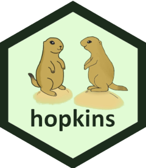

# hopkins 

[](https://cran.r-project.org/package=hopkins)
[](https://cranlogs.r-pkg.org/badges/hopkins)

Homepage: https://kwstat.github.io/hopkins

Repository: https://github.com/kwstat/hopkins

## Key features


## Installation

```R
# Install the released version from CRAN:
install.packages("hopkins")

# Install the development version from GitHub:
install.packages("devtools")
devtools::install_github("kwstat/hopkins")
```

## Usage

```R
library(hopkins)
hopkins(iris[, -5], m=15) # .9952293
hopkins.pval(0.21, 10) # .00466205
```

## About the logo

Prairie dogs cluster together in burrows, but the burrows are spaced somewhat evenly apart from each other.
The Hopkins statistic attempts to assess spatial distribution of points.
Also, prairie dogs are cute.
